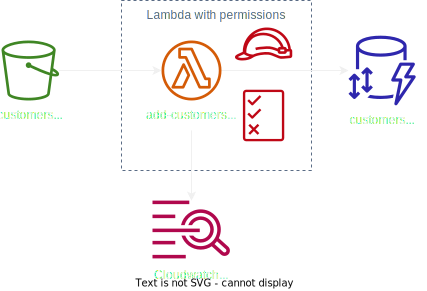

# NUWE-Zurich-Cloud-Hackathon
This repository contains all the files needed to start the online phase of the [NUWE x Zurich Cloud Challenge](https://nuwe.io/dev/competitions/zurich-cloud-hackathon/online-preselection-cloud-challenge)

<br>

## 🎯 Objective
The objective of this challenge is to automate data insertion into DynamoDB using a Lambda function and Terraform. The Lambda function will be triggered when a JSON file is uploaded to an S3 bucket.

<br>

## 💭 Assumptions
Based on the information provided, the following assumptions have been made:

1. The expected traffic in this environment is moderate.
1. The data will not be accessed frequently.
1. Simple queries will be performed on the data.

<br>

## 💡 Decisions
Considering the assumptions, the following decisions have been made:

1. A single DynamoDB table will be created to store all the data.
1. Data insertion will be handled by a Lambda function.

<br>

## 🏛️ Architecture
The architecture for this solution follows a simple serverless approach. The diagram below illustrates the architecture:

<p align="center">
    
</p>

<br>

## 🌟 Possible improvements
To enhance the solution, the following improvements could be considered:

- <b>Asynchronous Approach</b>: If the traffic volume increases, implementing an asynchronous approach can improve response time. In this approach, Lambda can send data to SQS, which will then insert it into DynamoDB. This allows Lambda to respond to the client faster while data is inserted asynchronously.

- <b>Database Normalization</b>: If the data is frequently accessed, consider normalizing the database by splitting it into three tables: Customers, Cars, and Fees. Additionally, splitting the Cars table into separate tables for general car model information and specific car specifications can simplify and speed up queries. Adding Global Secondary Indexes to the tables can further optimize query performance.

<br>

## 🏗️ Terraform
The infrastructure stack is created using Terraform, following best practices for naming conventions, code structure, and AWS architecture. The code is modular and reusable.

<br>

## ✅ Testing

The implementation has undergone manual testing, as automated tests were not within the scope of the challenge. The testing process includes the following steps:
1. Creation of a testing stack
2. Uploading a JSON file to the S3 bucket
3. Validation of data insertion into the database
4. Examination of Lambda function logs
5. Deletion of the testing stack

While a Python script can be developed to automate these steps if desired, the current manual testing process ensures the evaluation of solution performance and functionality.

<br>

## 🚀 How to run
To run the application, follow these steps:

1. Run `bash ./auto-install.sh` to install all the dependencies
1. Install the Terraform local provider by running pip install terraform-local.
1. Make sure you have ~/.aws/credentials file with the following content:
```
[default]
aws_access_key_id = fake
aws_secret_access_key = fake
```
and ~/.aws/config file with the following content:
```
[default]
region = us-east-1
output = json
```
1. Start LocalStack by running `localstack start`.
1. Navigate to the Terraform folder using `cd ./src/terraform`.
1. Initialize Terraform by running `tflocal init`.
1. Apply the Terraform configuration by running `tflocal apply`.

You can access the LocalStack dashboard at `https://app.localstack.cloud/dashboard/` and interact with the local AWS resources at `http://localhost:4566/`.